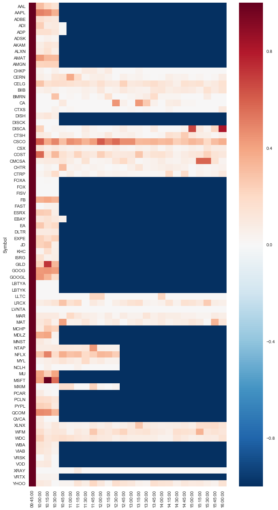
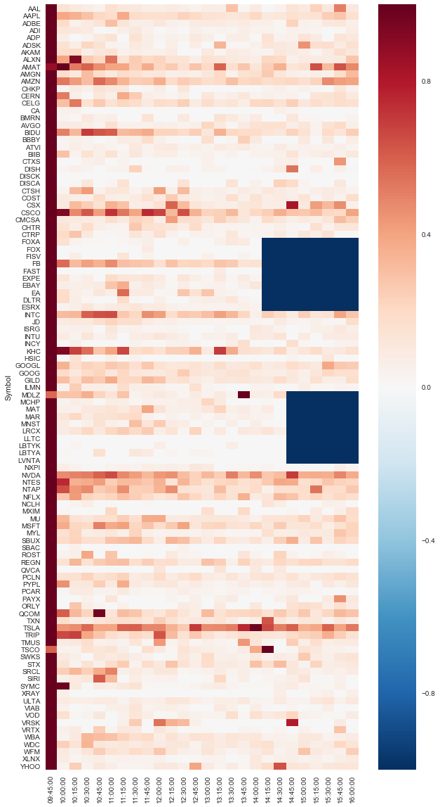

# yahoo-option-scraper
Homemade scraper &amp; crawler to fetch option data on Yahoo Finance using Selenium.

# Background
Option data has shown its usefulness in a lot of trading strategies in terms of predicting long term underlying movement. Intially this project was created to download daily option data at the end of the day (you can still do it). However, during the programming, I realized that it would be much more interesting to study intraday pattern provided that [Yahoo Finance updates its option data](http://finance.yahoo.com/quote/SPY/options?p=SPY) cumulatively over the day.

The difficulty of this project is that the option data element is not presented statically in the HTML file; rather, a javascript is triggered only by browser.open (sort of) event to load the data in. Therefore I had to resort to [Selenium](http://selenium-python.readthedocs.io/) to open the website in a browser. Due to this reason, make sure you have [Chrome WebDriver](https://chromedriver.storage.googleapis.com/index.html?path=2.27/) downloaded and added to the **%PATH%**

# How it works
Here you will see several files:
* yahoo_scraper.py: This is the one that does most of the heavy lifting. Once it has a symbol list, it can crawl and scrape all option data related to the symbols.
* live_nasdaq100.py: This file reads in your config.ini file, and then runs yahoo_scraper.py and saves the data to SQLite3 server. One has to modify it to fit his/her needs. In my setting, it downloads the symbol list of NASDAQ100.
* config_nasdaq100.py: Make a config file that can be read by live_nasdaq100.py.
* batch_cmds.py: Runs config_nasdaq100.py first, and bunch of live_nasdaq100.py's to speed up downloading process.
* post_analysis.py: Analyze overall system performance and option volume distribution.

# How far I got
On the first day I started 22 instances of live_nasdaq100.py's on my i7-4770K/16GB/2TB HDD Raid1 rig. So each instance kept downloading data of 5 symbols continuously. The CPU usage was almost always 100% during the day according to my wife since I left for work. By the end of the day, over half of the instances were terminated due to IO error (I need SSDs) but it still got over 1 million rows of records which take about 240MB on my drive. Below is a heat map of what happened during the day. (Blue means dead)

## Update 02-19-2017
The performance was better when I dialed down the number of instances from 22 to 10 and hopefully I can squash the remaining bugs soon.

